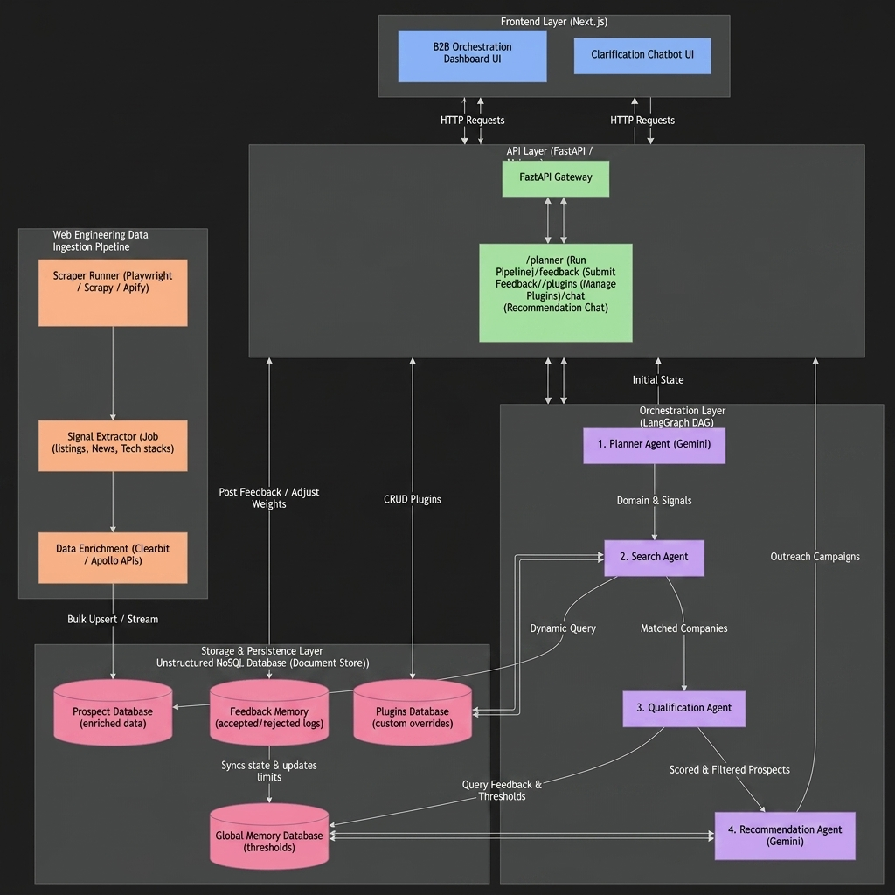

TEAM : AP&TS

github link : https://github.com/Adithya-001-bit/b2b_agent/

# Agentic AI Prospect Intelligence Platform

An advanced, adaptive agentic AI platform designed to automate high-intent B2B prospect identification, qualification, and outreach campaign generation. Powered by **LangGraph**, **FastAPI**, and **Next.js**, the platform leverages a collaborative multi-agent architecture and a stateful human-in-the-loop feedback loop that dynamically optimizes target lead profiles.

---

## 🏗️ System Architecture

The platform is designed around a decoupled, microservice-ready architecture that isolates the Next.js front-end client, the FastAPI gateway server, the LangGraph agentic orchestration engine, and an unstructured NoSQL document storage layer.



### Architectural Flow:
1. **Frontend ↔ Backend**: Next.js communicates bidirectionally with FastAPI using REST APIs for triggering executions, retrieving logs, and managing plugins.
2. **Backend ↔ Orchestration**: FastAPI manages a stateful LangGraph cycle that coordinates task execution between four specialized agents.
3. **Orchestration ↔ Database**: The agents query the unstructured **Prospect Database** to find matches, reference **Domain Plugins** for configuration overrides, and update **Feedback Memory** dynamically.

---

## 🤖 Collaborative Agentic Workflow

The platform leverages **LangGraph** to model the search-qualification-recommendation pipeline as a deterministic state machine. The workflow consists of four collaborative agents:

```
┌─────────────────┐     ┌─────────────────┐     ┌─────────────────┐     ┌─────────────────┐
│  1. PLANNER     │ ──> │    2. SEARCH    │ ──> │3. QUALIFICATION │ ──> │4. RECOMMENDATION│
│     AGENT       │     │      AGENT      │     │     AGENT       │     │     AGENT       │
└─────────────────┘     └─────────────────┘     └─────────────────┘     └─────────────────┘
```

1. **Planner Agent (Gemini)**: Takes a natural language query (e.g., *"startups building AI solutions in healthcare"*) and extracts the target industry domain, target signals, and key buyer personas. It translates unstructured intent into structured query parameters.
2. **Search Agent**: Queries the unstructured **Prospect Database** (NoSQL collections) to identify businesses matching the extracted domain and signal criteria.
3. **Qualification Agent**: Evaluates company fit. It scores the leads based on employee size, matches signal keywords, and filters prospects against user constraints fetched from the live **Feedback Memory**.
4. **Recommendation Agent (Gemini)**: Generates highly tailored, personalized outbound outreach email copy for the target personas identified, highlighting the company's matched signals.

---

## 🔌 Custom Plugin Orchestration

Sales teams can bypass the default LLM parsing rules by creating and applying **Domain Override Plugins**. This ensures rigid criteria matching when executing campaigns.

* **Dynamic Creation**: Users can configure new override rules directly from the frontend UI by entering:
  * Target Domain (e.g., `SaaS`)
  * Minimum Employee Count (e.g., `120`)
  * Signal Keywords (e.g., `ai automation, workflow automation`)
  * Target personas (e.g., `Product Manager, CTO`)
* **Persistence**: Custom plugins are saved directly into the unstructured document store (`memory/domain_plugins.json`) and instantly reload into the UI selection dropdown.
* **Orchestration Bypass**: When a plugin is selected, the **Planner Agent** bypasses LLM inference and applies the plugin's strict criteria directly to the downstream Search and Qualification agents.

---

## 🧠 Reinforcement & Feedback Memory System

The platform features an adaptive, real-time learning loop that updates search parameters on the fly based on human decisions (Accept/Reject):

* **Human-in-the-Loop Approval**: Users review matched prospects and click **Accept** or **Reject**.
* **Memory Updates**: Rejecting a prospect triggers a `POST` request to the backend that updates the **Feedback Memory** document:
  * Automatically increments the `min_employee_count` by **10** (dynamic thresholding).
  * appends the user's rejection reason (e.g., *"not looking for SaaS sales"*) to `rejected_reasons[]`.
* **Subsequent Query Optimization**: On subsequent search iterations, the **Qualification Agent** reads these memory logs and automatically penalizes or filters out prospects that fall under the updated constraints.

---

## 💾 Unstructured Database Schema (NoSQL Document Store)

To accommodate highly varied corporate datasets, crawl outcomes, and changing memory structures, the platform utilizes unstructured JSON document collections simulating a NoSQL/MongoDB setup:

### 1. Prospects Collection (`data/prospects.json`)
Stores company profiles, crawled signals, and nested contact data:
```json
{
  "_id": "64a7c8e9f1d2c3b4a5e6f7a1",
  "company_name": "AgroTech Solutions",
  "domain": "Agriculture",
  "employee_count": 45,
  "signals": ["smart farming", "drones", "iot monitoring"],
  "contacts": [
    {
      "name": "Sarah Jenkins",
      "role": "VP of Engineering",
      "email": "sarah.j@agrotech.com",
      "phone": "+1-555-0198"
    }
  ],
  "metadata": {
    "crawled_at": "2026-06-29T08:00:00Z",
    "source_url": "https://agrotech.com"
  }
}
```

### 2. Feedback Memory Collection (`memory/feedback_memory.json`)
Tracks adaptive scoring thresholds and rejection signals:
```json
{
  "_id": "64a7c8e9f1d2c3b4a5e6f7a2",
  "user_id": "default_user",
  "min_employee_count": 50,
  "rejected_reasons": ["not relevant", "expecting more signals"],
  "last_updated": "2026-06-29T08:15:30Z"
}
```

### 3. Domain Override Plugins Collection (`memory/domain_plugins.json`)
Stores custom configuration settings created dynamically via the frontend form:
```json
{
  "_id": "64a7c8e9f1d2c3b4a5e6f7a3",
  "domain": "SaaS",
  "name": "AI Automation Finder",
  "signals": ["ai automation", "workflow automation"],
  "employee_count": 100,
  "created_at": "2026-06-29T08:10:00Z"
}
```

---

## 🛠️ Technology Stack

* **Frontend**: Next.js (React), TailwindCSS, custom CSS micro-animations (Pulse Tracks, typewriter outreach loaders).
* **Backend**: FastAPI, Uvicorn, LangGraph (Graph States & Transitions), Google GenAI SDK (Gemini API).
* **Data Layer**: Unstructured Document Store (JSON files mimicking NoSQL schema structures).

---

## 🚀 Setup & Local Execution Guide

### Prerequisites
* **Node.js** (v18 or higher)
* **Python** (3.10 or higher)
* **Gemini API Key**

### 1. Backend Setup
1. Navigate to the backend directory:
   ```bash
   cd backend
   ```
2. Create and activate a virtual environment:
   ```bash
   # Windows (PowerShell)
   python -m venv venv
   .\venv\Scripts\Activate.ps1

   # macOS / Linux
   python3 -m venv venv
   source venv/bin/activate
   ```
3. Install dependencies:
   ```bash
   pip install -r requirements.txt
   ```
4. Create a `.env` file in the `backend` folder and add your Gemini API Key:
   ```env
   GEMINI_API_KEY=your_gemini_api_key_here
   ```
5. Start the FastAPI server:
   ```bash
   uvicorn main:app --reload
   ```
   The backend API will run at `http://127.0.0.1:8000`.

### 2. Frontend Setup
1. Open a new terminal and navigate to the frontend directory:
   ```bash
   cd frontend
   ```
2. Install npm packages:
   ```bash
   npm install
   ```
3. Start the Next.js development server:
   ```bash
   npm run dev
   ```
   Open `http://localhost:3000` in your browser to access the dashboard.

---

## 🔮 Future Improvements (Ingestion & Web Engineering Pipeline)

To take this platform from a local terminal to a production enterprise system, the following pipeline extensions are planned:

1. **Production Document Store**: Migrate the local JSON file stores to a clustered MongoDB or Amazon DocumentDB database for atomicity and high-throughput concurrent querying.
2. **Ingestion Crawlers**: Deploy background crawler workers using **Playwright** and **Scrapy** to scan corporate sites and press releases daily for new hiring triggers or product announcements.
3. **Data Enrichment**: Integrate API connectors with clearbit or Apollo to dynamically fetch employee count distributions, verified corporate emails, and telephone numbers.
4. **Cron Search Triggers**: Build an automated scheduler to run recurring search queries and notify account executives when high-intent prospects match active signals.
